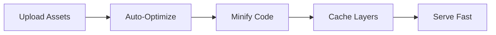

## Overview

Leonid 91 empowers you to build high-performance websites optimized for search engines and responsive across devices. Developed by Agenc.io, it combines speed, SEO best practices, flexible design tools, and intuitive content management into one platform. You gain access to automated optimizations that reduce load times `<100ms` while ensuring your site ranks higher on search results.

<Callout kind="info">
  Start with Leonid 91's core dashboard at `https://dashboard.agenc.io` to activate these features instantly.
</Callout>

## Key Features

Explore the foundational capabilities through these highlighted tools.

<Columns cols={2}>
  <Card title="Performance Boost" icon="zap" href="#performance">
    Achieve lightning-fast sites with built-in compression and caching.
  </Card>
  <Card title="SEO Mastery" icon="search" href="#seo">
    Manage meta tags and structured data effortlessly.
  </Card>
  <Card title="Responsive Themes" icon="smartphone" href="#responsive">
    Deploy mobile-first designs that adapt seamlessly.
  </Card>
  <Card title="Content Suite" icon="edit-3" href="#content">
    Edit text, images, and videos without coding.
  </Card>
</Columns>

## Performance Optimization Techniques

Leonid 91 applies advanced techniques to minimize load times and maximize Core Web Vitals scores. You enable image optimization, lazy loading, and code minification with a single toggle.

<Steps>
  <Step title="Enable Caching" icon="settings">
    Navigate to the Performance panel and select browser caching rules.

````bash
# Example config in your site settings
cache: {
  staticAssets: "1y",
  dynamicContent: "1h"
}
````

  </Step>
  <Step title="Optimize Images" icon="image">
    Upload assets; Leonid 91 auto-converts to WebP with lazy loading.

  </Step>
  <Step title="Minify Assets" icon="code">
    Activate JS/CSS minification for `<50%` file size reduction.
  </Step>
</Steps>



<Callout kind="tip">
  Monitor performance via integrated Lighthouse scores in the dashboard.
</Callout>

## SEO Integration and Meta Tag Management

You control all SEO elements directly from Leonid 91's editor. Generate dynamic meta titles, descriptions, and Open Graph tags for social sharing.

<Tabs>
  <Tab title="Meta Tags" icon="tag">
    Edit site-wide or per-page SEO.

<CodeGroup tabs="HTML,JSON">
```html
<head>
  <title>Your Optimized Title | Agenc.io</title>
  <meta name="description" content="Fast, SEO-friendly site by Leonid 91">
  <meta property="og:image" content="https://cdn.agenc.io/og-image.jpg">
</head>
```
```json
{
  "seo": {
    "title": "Your Optimized Title",
    "description": "Fast, SEO-friendly site",
    "image": "https://cdn.agenc.io/og-image.jpg"
  }
}
```
</CodeGroup>
  </Tab>
  <Tab title="Structured Data" icon="database">
    Add JSON-LD schemas automatically.

```json
<script type="application/ld+json">
{
  "@context": "https://schema.org",
  "@type": "WebSite",
  "name": "Leonid 91 Site"
}
</script>
```
  </Tab>
</Tabs>

## Responsive Design Templates and Themes

Leonid 91 provides pre-built themes that respond to any screen size. You customize breakpoints and layouts using a visual editor.

| Feature | Mobile | Tablet | Desktop |
|---------|--------|--------|---------|
| Grid System | 1-12 cols | 1-12 cols | 1-12 cols |
| Breakpoints | `<640px` | `640px-1024px` | `>1024px` |
| Themes | 20+ free | Customizable | Full control |

<Expandable title="Advanced Theme Customization" default-open="false">
  Override CSS variables for brand color `#7c7c7c`.

````css
:root {
  --brand-color: #7c7c7c;
  --breakpoint-md: 768px;
}

@media (min-width: var(--breakpoint-md)) {
  .container { max-width: 1024px; }
}
````
</Expandable>

## Content Editing and Multimedia Support

Edit content live with Leonid 91's WYSIWYG editor. Drag-and-drop images, videos, and embeds while maintaining performance.

- **Rich Text**: Bold, lists, links with auto-SEO.
- **Multimedia**: Upload to CDN, auto-optimize videos.
- **Embeds**: YouTube, Vimeo with lazy loading.

<ParamField body="content" param-type="object" required="true">
  JSON structure for dynamic content blocks.
</ParamField>

<ParamField body="media" param-type="array" required="false">
  Array of image/video URLs.
</ParamField>

These features ensure your site from Agenc.io stays fast, visible, and engaging. Next, explore [quickstart](/quickstart) for hands-on setup.