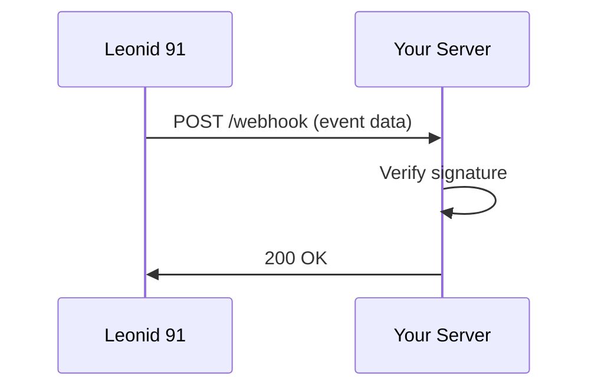

## Overview

Leonid 91 supports seamless integrations with popular third-party services. You connect analytics tools to track visitor behavior, email platforms for lead capture, e-commerce plugins for sales, and custom webhooks for advanced automation. These integrations help you build a powerful, connected online presence without custom development.

<Columns cols={2}>
  <Card title="Analytics Tools" icon="bar-chart-3" href="#analytics">
    Track performance with Google Analytics or privacy-focused alternatives.
  </Card>
  <Card title="Email Marketing" icon="mail" href="#email">
    Capture leads and automate campaigns via forms.
  </Card>
  <Card title="E-commerce" icon="shopping-cart" href="#ecommerce">
    Sync with Shopify or WooCommerce for seamless sales.
  </Card>
  <Card title="Custom Webhooks" icon="zap" href="#webhooks">
    Trigger actions with real-time event notifications.
  </Card>
</Columns>

## Analytics and Tracking Tools

Set up analytics to monitor site traffic and user engagement. Leonid 91 provides easy script injection and event tracking.

<Tabs>
  <Tab title="Google Analytics" icon="google">
    Add your Google Analytics ID in the dashboard.

    <Steps>
      <Step title="Get Tracking ID">
        Log into Google Analytics and copy your `GA_MEASUREMENT_ID` (format: `G-XXXXXXXXXX`).
      </Step>
      <Step title="Configure in Dashboard">
        Navigate to Settings > Integrations > Analytics.
      </Step>
      <Step title="Enable Events">
        Toggle `track_pageviews` and `track_forms` to `true`.
      </Step>
    </Steps>

    ```html
    <script async src="https://www.googletagmanager.com/gtag/js?id=G-XXXXXXXXXX"></script>
    <script>
      window.dataLayer = window.dataLayer || [];
      function gtag(){dataLayer.push(arguments);}
      gtag('js', new Date());
      gtag('config', 'G-XXXXXXXXXX');
    </script>
    ```
  </Tab>
  <Tab title="Plausible" icon="eye">
    Use privacy-friendly analytics.

    ```html
    <script defer data-domain="your-site.com" src="https://plausible.io/js/script.js"></script>
    ```
  </Tab>
</Tabs>

<Callout kind="tip">
  Test integrations in preview mode before going live to avoid data discrepancies.
</Callout>

## Email Marketing and Form Integrations

Connect forms to email services like Mailchimp or ConvertKit. You map form fields to subscriber lists directly in the Leonid 91 dashboard.

<CodeGroup tabs="Mailchimp,ConvertKit">
  ```javascript
  // Mailchimp API payload
  fetch('https://us-central1.agenc.io/api/lists/{LIST_ID}/members', {
    method: 'POST',
    headers: { 'Authorization': 'Bearer YOUR_API_KEY' },
    body: JSON.stringify({
      email_address: form.email,
      status: 'subscribed',
      merge_fields: { FNAME: form.name }
    })
  });
  ```
  ```javascript
  // ConvertKit subscriber
  fetch('https://api.convertkit.com/v3/subscribers', {
    method: 'POST',
    headers: { 'Authorization': 'Bearer YOUR_SECRET_KEY' },
    body: JSON.stringify({
      email: form.email,
      first_name: form.name
    })
  });
  ```
</CodeGroup>

## E-commerce Plugin Connections

Integrate with e-commerce platforms to handle payments and inventory.

<Columns cols={3}>
  <Card title="Shopify" icon="shopping-bag" horizontal>
    Embed buy buttons and sync products.
  </Card>
  <Card title="WooCommerce" icon="wordpress" horizontal>
    Connect via REST API for order tracking.
  </Card>
  <Card title="Stripe Checkout" icon="credit-card" horizontal>
    Add one-click payments with web components.
  </Card>
</Columns>

## Custom Code and Webhook Configurations

For advanced workflows, use webhooks to receive real-time events from Leonid 91, such as form submissions or page views.

### Webhook Setup

1. Generate a webhook URL in Dashboard > Integrations > Webhooks.
2. Configure your endpoint to handle `POST` requests.

<ParamField header="Leonid-Signature" param-type="string" required="true">
  HMAC SHA-256 signature for payload verification using your secret.
</ParamField>

<ParamField body="event" param-type="string" required="true">
  Event type: `form_submit`, `page_view`, `purchase`.
</ParamField>



<Expandable title="Verify Payload Signature" default-open="false">
  Use Node.js to validate incoming webhooks:

  ````javascript
  const crypto = require('crypto');

  function verifySignature(payload, signature, secret) {
    const hmac = crypto.createHmac('sha256', secret);
    const digest = 'sha256=' + hmac.update(payload).digest('hex');
    return crypto.timingSafeEqual(Buffer.from(signature), Buffer.from(digest));
  }

  // In Express handler
  app.post('/webhook', (req, res) => {
    const sig = req.headers['leonid-signature'];
    if (!verifySignature(req.body, sig, process.env.WEBHOOK_SECRET)) {
      return res.status(401).send('Invalid signature');
    }
    // Process event
    res.status(200).send('OK');
  });
  ````
</Expandable>

<Callout kind="alert">
  Always verify webhook signatures to prevent unauthorized requests. Store secrets securely.
</Callout>